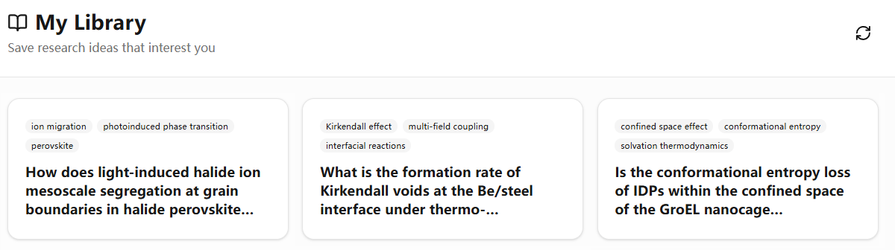
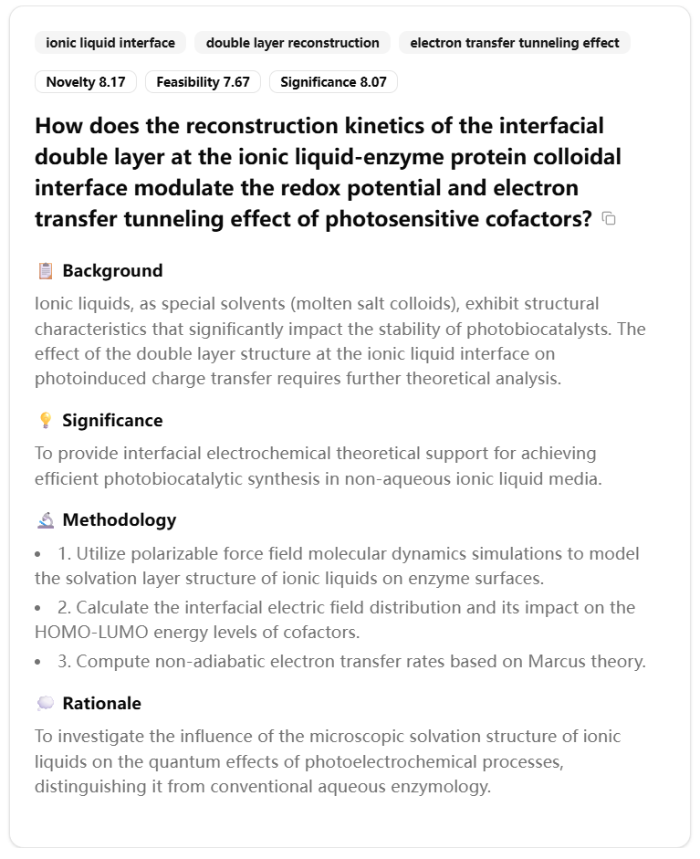
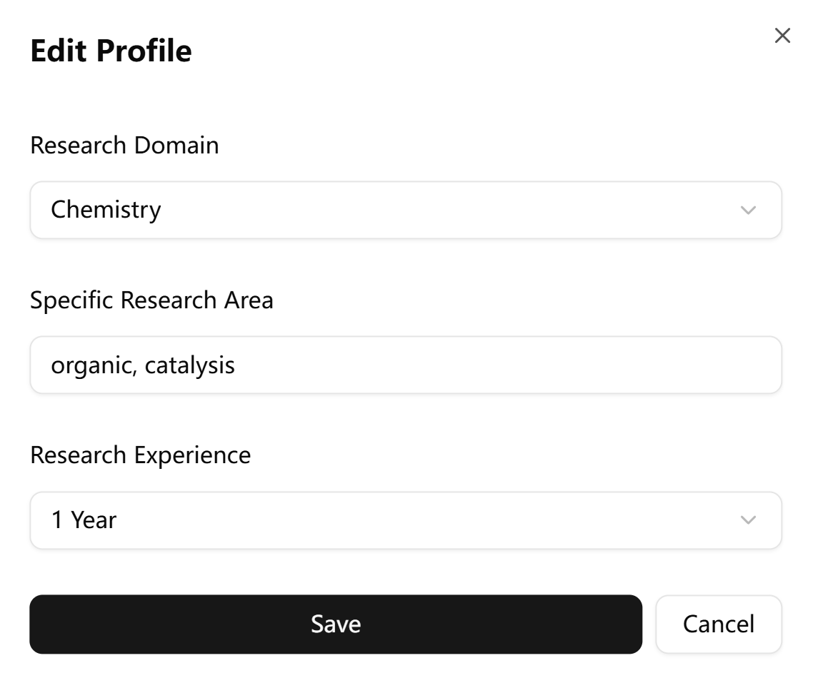
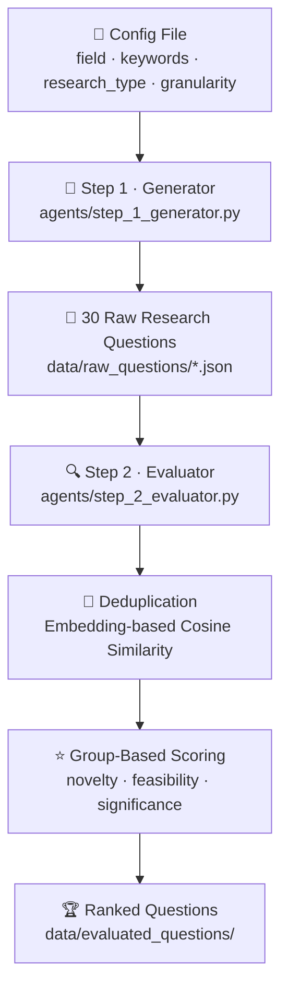

<div align="center">
  <h1>IdeaMiner</h1>
  <p>A two-stage LLM pipeline for generating and evaluating novel scientific research questions.</p>
</div>

<div align="center">

[](https://discovery-ideaminer.intern-ai.org.cn/)&#160;
[](https://github.com/xuwanghan/IdeaMiner)&#160;

</div>

IdeaMiner is a two-stage pipeline for generating and evaluating novel scientific research questions using LLM agents. It covers a broad taxonomy of academic disciplines and produces ranked, deduplicated research questions scored on novelty, feasibility, and significance.

---

## 🌐 Try It Online

Visit our [official platform](https://discovery-ideaminer.intern-ai.org.cn/) to explore AI-generated research ideas across disciplines — no setup required.

<p align="center">
  
</p>

Browse and save ideas from your personal library. Each card shows the research question along with its key topic tags.

<br>

<table align="center">
  <tr>
    <td align="center" width="50%">
      <br>
      <b>Idea Detail View</b> — Each ranked question comes with Background, Significance, Methodology, and Rationale, alongside novelty, feasibility, and significance scores.
    </td>
    <td align="center" width="50%">
      <br>
      <b>Personalized Profile</b> — Set your research domain and experience level so the platform surfaces the most relevant ideas for you.
    </td>
  </tr>
</table>

<br>

<p align="center">
  
</p>
<p align="center">
  Quick-action buttons let you skip, dislike, like, copy, or navigate between ideas with a single click.
</p>

---

## ⚙️ How It Works



**Step 1 – Generation** (`agents/step_1_generator.py`):
Each config file specifies a scientific field, a set of keywords, a research type, and a granularity level. The generator prompts an LLM to produce 30 diverse and novel research questions.

**Step 2 – Evaluation** (`agents/step_2_evaluator.py`):
The evaluator first deduplicates questions using embedding-based cosine similarity, then scores the remaining questions across multiple rounds using a group-based approach. Each group is assessed by one or more LLM models that can invoke a `web_search` tool to ground their evaluations in current literature.

---

## 📂 Project Structure

```
IdeaMiner/
├── agents/
│   ├── step_1_generator.py   # Question generation agent
│   └── step_2_evaluator.py   # Question evaluation and ranking agent
├── utils/
│   ├── langchain_agent.py    # Async LangChain agent with tool support
│   ├── langchain_tools.py    # web_search and paper_search tools
│   ├── langchain_utils.py    # Custom embeddings with HuggingFace tokenizer support
│   └── tools.py              # Standalone Semantic Scholar search function
├── configs/
│   └── subject.py            # Academic discipline taxonomy and config generator
├── sh/
│   ├── 1_gen.sh              # Batch generation script
│   └── 2_eval.sh             # Batch evaluation script
├── assets/                   # Images for README and documentation
├── data/
│   ├── raw_questions/        # Output of Step 1 (git-ignored)
│   └── evaluated_questions/  # Output of Step 2 (git-ignored)
├── logs/                     # Runtime logs (git-ignored)
├── .env.example              # Environment variable template
├── requirements.txt          # Python dependencies
└── LICENSE                   # MIT License
```

---

## 📦 Dependencies

This project uses [StructAI](https://github.com/xuwanghan/structai) as its core utility library, which provides the `LLMAgent`, `load_file`, `save_file`, and other helpers used throughout the codebase.

---

## 🚀 Setup

### 1. Install dependencies

```bash
pip install -r requirements.txt
```

### 2. Configure environment variables

```bash
cp .env.example .env
# Edit .env and fill in your API keys
```

Required variables:

| Variable | Description |
|---|---|
| `LLM_API_KEY` | API key for your OpenAI-compatible LLM provider |
| `LLM_BASE_URL` | Base URL of the API (default: `https://api.openai.com/v1`) |
| `TAVILY_API_KEYS` | Comma-separated Tavily search API keys (or use `TAVILY_API_KEY`) |

Optional variables:

| Variable | Description |
|---|---|
| `SEMANTIC_SCHOLAR_API_KEY` | Increases the Semantic Scholar API rate limit |

### 3. Generate config files

The `configs/subject.py` script generates random experiment configs and writes them to `configs/`:

```bash
python configs/subject.py
```

Or write your own JSON config:

```json
{
    "field": "Life Sciences",
    "keywords": ["Genomics", "CRISPR", "Epigenetics"],
    "research_type": "Experiment",
    "granularity_level": "Microscopic"
}
```

---

## 💻 Usage

### Run the full pipeline

```bash
# Step 1: Generate questions for all configs
./sh/1_gen.sh

# Step 2: Evaluate and rank the generated questions
./sh/2_eval.sh
```

### Run individual steps

```bash
# Generate questions for a single config
python agents/step_1_generator.py --config_path configs/my_config.json

# Evaluate a single raw question file
python agents/step_2_evaluator.py \
    --input_file data/raw_questions/my_config.json \
    --output_dir data/evaluated_questions/my_config/ \
    --field "Life Sciences" \
    --models gpt-4o-mini \
    --comparison_rounds 3 \
    --group_size 5
```

### Key parameters for evaluation

| Parameter | Default | Description |
|---|---|---|
| `--similarity_threshold` | `0.85` | Cosine similarity threshold for duplicate removal |
| `--filter_batch_size` | `50` | Questions per filtering batch |
| `--comparison_rounds` | `3` | Number of scoring rounds per question |
| `--group_size` | `5` | Questions per scoring group |
| `--models` | `gpt-4o-mini` | Space-separated list of scorer models |
| `--max_concurrent_tasks` | `32` | Maximum parallel async scoring tasks |

---

## 📊 Output Format

After evaluation, each output directory contains:

| File | Description |
|---|---|
| `filtered_questions.json` | Questions after deduplication |
| `evaluation_results.json` | Full results including per-model scores |
| `ranked_questions.json` | Questions sorted by consensus score (best first) |
| `summary.json` | Statistics and top-10 questions |

Each ranked question includes:

```json
{
    "question": "...",
    "background": "...",
    "average_scores": {
        "novelty": 8.2,
        "feasibility": 7.5,
        "significance": 8.8,
        "total": 8.17
    },
    "rank": 1
}
```

---

## 📬 Contact

- **GitHub Issues**: Please open an issue for bug reports or feature requests
- **Community**:

<p align="center">
  
</p>

---

## 📜 License

MIT License. See [LICENSE](LICENSE) for details.

<p align="right"><a href="#top">🔝 Back to top</a></p>
